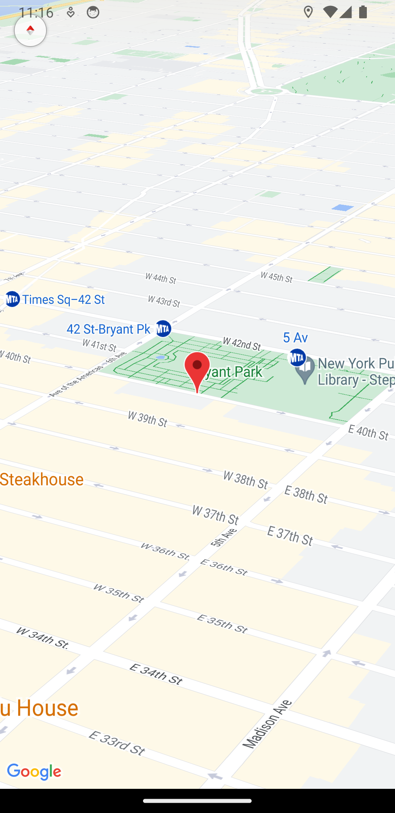

# Real-Time Map with Route Simulation

## Purpose

- The main purpose of this project is to provide a simple example of how to create a real-time map application using React Native and Expo. It demonstrates how to request location permissions, track the user's location in real-time, and display it on a map. Additionally, it simulates movement by continuously updating the marker's position as if you were following a route.

## Map Preview

### Screenshot:

  
  <br>

## Technologies Used

- React Native
- Expo
- Expo Location Api
- React Native Maps

## How to Use

### Clone the repository to your local machine:

```bash
git clone git@github.com:FranciscoVieir/rn-maps.git
```

### Access the folder

```bash
cd rnmaps
```

## Install dependencies:

```bash
npm install
```

#### or

```bash
yarn start
```

## Availble Scripts

In the project, directory, you can run the following scripts:

- npm run start or yarn start: Starts the Expo development server.
- npm run android or yarn android: Runs the app on an Android emulator/simulator.
- npm run ios or yarn ios: Runs the app on an iOS simulator.
- npm run eject or yarn eject: Ejects the app from Expo, if needed.
